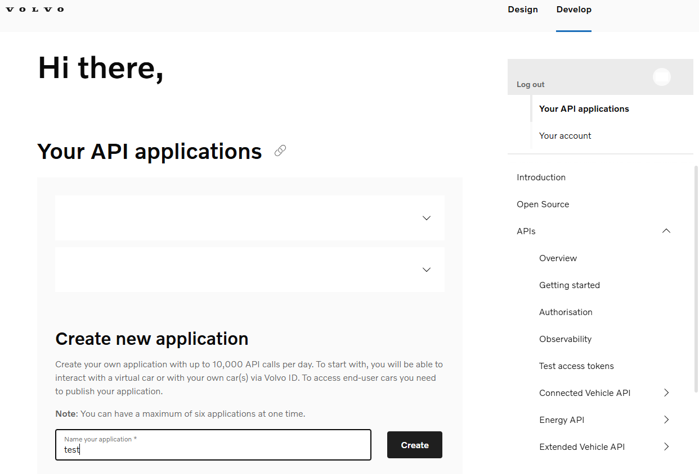
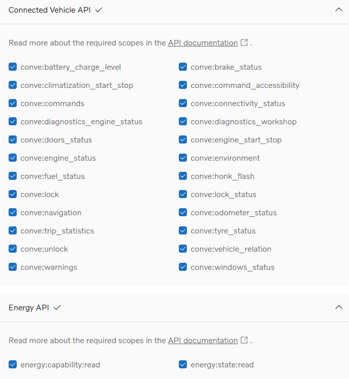
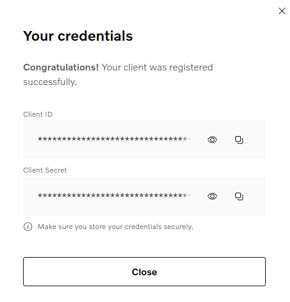

# Volvo Vehicle Data Exporter

A Python-based tool that connects to Volvo's Connected Vehicle APIs to collect vehicle telemetry and export it as Prometheus metrics.

## Overview

This project authenticates with Volvo's API platform and periodically polls for vehicle data across multiple API specifications, including:
- **Connected Vehicle C3** - Core vehicle data (fuel, battery, doors, windows, locks, etc.)
- **Extended Vehicle C3** - Diagnostic and status information
- **Energy API** - EV-specific battery and charging data
- **Location API** - Vehicle location data

The collected data is exposed through a Prometheus-compatible HTTP endpoint for monitoring and time-series analysis.

## Project Structure

```
├── auth.py                 # Volvo API authentication (OAuth2 with PKCE)
├── config.yaml             # Configuration file with API credentials
├── config.example.yaml     # Configuration template
├── requirements.txt        # Python dependencies
├── Dockerfile              # Container image definition
├── docker-compose.yml      # Docker Compose configuration
├── exporter.py             # Prometheus metrics exporter and data poller
├── volvo_token.json        # Token storage (generated at runtime)
├── volvo_token.json.bak    # Backup token storage
├── README.md               # This file
├── .gitignore              # Git ignore rules
├── grafana/                # Grafana dashboard and provisioning
│   ├── README.md           # Dashboard setup instructions
│   ├── volvo-vehicle-dashboard.json # Main telemetry dashboard
│   └── provisioning/       # Grafana provisioning files
│       └── datasources/    # Data source configurations
│           └── prometheus.yml
├── open-api/               # API specification files
│   ├── connected-vehicle-c3-specification.html
│   ├── connected-vehicle-c3-specification.json
│   ├── energy-api-specification.html
│   ├── energy-api-specification.json
│   ├── extended-vehicle-c3-specification.html
│   ├── extended-vehicle-c3-specification.json
│   ├── location-specification.html
│   └── location-specification.json
├── pictures/               # Images for README instructions
├── prometheus/             # Prometheus configuration
│   ├── prometheus.yml
│   └── alert_rules.yml
└── alertmanager/           # Alertmanager configuration
    └── alertmanager.yml
```

## Features

- **OAuth2 Authentication** - Secure authentication with PKCE flow to Volvo ID platform
- **Multiple API Support** - Polls data from Connected Vehicle, Extended Vehicle, Energy, and Location APIs
- **Prometheus Integration** - Exposes metrics in Prometheus format on HTTP endpoint
- **Grafana dashboard** - Provides a Grafana dashboard with all metrics collected in Prometheus
- **Alertmanager Notifications** - Sends alerts via Slack webhooks for vehicle issues and system monitoring
- **Comprehensive Metrics** - Tracks vehicle attributes (VIN, model, fuel type, battery capacity) and real-time data
- **Error Tracking** - HTTP request metrics with status codes and duration
- **Configurable Polling** - Adjustable scrape intervals via config
- **Secure Token Management** - Automatic token refresh with backup preservation

## Installation

1. Clone the repository:
```bash
git clone https://github.com/xaxeu/volvo-vehicle-exporter.git
cd volvo-vehicle-exporter
```

2. Install dependencies:
```bash
pip install -r requirements.txt
```

## Instructions to create an application on volvocars website

0 - Create an account on volvocars obviously

1 - Login to volvocars account: https://developer.volvocars.com/account/

2 - Create new application


3 - That will list your app in the list. Expand it and copy VCC API key - Primary: This is the api_key to use on config.yaml

4 - Select Publish

5 - Fill the form and ensure you expand all scope groups and select all of them


5.1 - For the Redirect URI(s) use your ngrok agent Endpoint url. You can check it on https://dashboard.ngrok.com/agents

*Side note : I tried to use my domain with Lets encrypt certificate, but for some reason Volvocars doesn't accept it and your App never gets published.
The alternative I found working is creating an endpoint on ngrok (https://ngrok.com/) pointing to the server hosting this exporter. This is just a suggestion. Feel free to use other alternatives.*

Click on the 3 dots button and select "See agent details"


5.2 - Copy this endpoint URL as redirect_uri value on your config.yaml

6 - Select Publish

7 - Copy Client Id and Client Secret to config.yaml


3. Configure credentials in `config.yaml`:
   - `client_id` - Volvo API application ID
   - `client_secret` - Volvo API application secret
   - `api_key` - Volvo VCC API key - Primary
   - `redirect_uri` - OAuth callback URL
   - `vin` - Vehicle VIN to monitor
   - `weather_api_key` - Optional weather service integration

## Usage

1. **First-time Authentication**:
   ```bash
   python auth.py
   ```
   This initiates the OAuth2 flow and stores the authentication token in `volvo_token.json`.

2. **Start the Exporter**:
   ```bash
   python exporter.py
   ```
   The exporter will:
   - Load configuration from `config.yaml`
   - Authenticate with Volvo API
   - Expose Prometheus metrics on `http://localhost:9100/metrics`
   - Poll vehicle data at intervals specified in `scrape_interval`

## Docker Deployment alternative

### Build Docker Image

```bash
docker build -t volvo-exporter .
```

### First Time Setup (Obtain Initial Token)

Run the container in interactive mode to authenticate with Volvo:

```bash
docker run -it --rm \
  --name volvo-exporter \
  -p 9100:9100 \
  -v $(pwd):/app \
  volvo-exporter
```

Then:
1. Access the URL provided in the console
2. Login with your Volvo Cars credentials
3. Copy the redirected URL from your browser
4. Paste it into the console
5. Press `CTRL+C` to stop (token is now saved in `volvo_token.json`)

### Run as Background Service

Once you have the token, use Docker Compose to run as a daemon:

```bash
docker-compose up -d volvo-exporter
```

The service will:
- Automatically refresh the token
- Expose Prometheus metrics on `http://localhost:9100/metrics`
- Restart automatically on failure
- Run in the background

## Monitoring with Grafana

Visualize vehicle telemetry data with Grafana dashboards:

- Real-time vehicle metrics and status
- Battery charge and fuel level gauges
- Door and window state monitoring
- Tire pressure trends
- Diagnostics and warning indicators

See [grafana/README.md](grafana/README.md) for setup instructions.

## Alertmanager Notifications

The project includes Alertmanager for handling alerts based on Prometheus rules, with notifications sent via Slack webhooks.

### Features:
- **Slack Integration** - Alerts are sent to configured Slack channels using incoming webhooks
- **Alert Rules** - Pre-configured rules monitor vehicle exporter health and can be extended for vehicle-specific alerts
- **Grouping and Routing** - Alerts are grouped by alert name with configurable timing for reduced noise
- **Resolved Notifications** - Sends notifications when alerts are resolved

### Configuration:
1. **Slack Webhook Setup**:
   - Create a Slack app at https://api.slack.com/apps
   - Add "Incoming Webhooks" feature
   - Create a webhook URL for your desired channel
   - Update `alertmanager/alertmanager.yml` with your webhook URL:
     ```yaml
     global:
       slack_api_url: 'https://hooks.slack.com/services/YOUR/SLACK/WEBHOOK/URL'
     ```

2. **Alert Rules**:
   - Customize alert rules in `prometheus/alert_rules.yml`

3. **Alertmanager Access**:
   - Web UI available at `http://localhost:9093`
   - View active alerts, silenced alerts, and alert history

### Docker Deployment:
Alertmanager is included in the Docker Compose setup and starts automatically with other services.

The exporter provides:
- **Vehicle Attributes** - VIN, model year, fuel type, gearbox, battery capacity, etc.
- **Real-time Data** - Fuel levels, battery charge, door/window states, tire pressure, etc.
- **Diagnostics** - Engine status, warnings, maintenance indicators
- **HTTP Metrics** - Request count, duration, and status codes

All metrics are labeled with vehicle attributes for easy filtering and aggregation.

## Authentication Flow

Uses OAuth2 with PKCE (Proof Key for Code Exchange) for secure authentication without exposing client secrets directly. The implementation:
1. Generates a code verifier and challenge
2. Redirects user to Volvo ID authorization
3. Exchanges authorization code for access token
4. Stores token locally with automatic refresh handling

## Environment Variables

- `LOG_LEVEL` - Logging verbosity (`info` or `debug`, default: `info`)

## Files

| File | Purpose |
|------|---------|
| `auth.py` | OAuth2 authentication and token management |
| `exporter.py` | Prometheus metrics exporter and API poller |
| `config.yaml` | API credentials and configuration |
| `requirements.txt` | Python package dependencies |
| `prometheus/prometheus.yml` | Prometheus configuration with alerting |
| `prometheus/alert_rules.yml` | Alert rules for monitoring |
| `alertmanager/alertmanager.yml` | Alertmanager configuration for Slack notifications |
| `grafana/volvo-vehicle-dashboard.json` | Grafana dashboard definition |
| `open-api/` | Volvo API specification documentation |

## Notes

- Token files are backed up before invalidation to prevent data loss
- Metrics endpoint sanitizes URLs to prevent high cardinality issues
- Window and door states are normalized to numeric values for Prometheus
- The application includes comprehensive HTTP request tracking for debugging

## Status

This is not an active development project.
