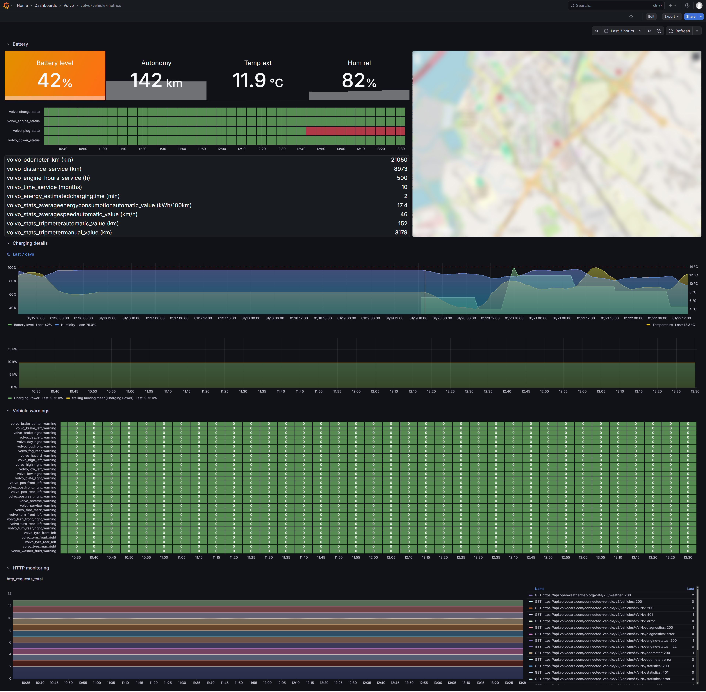

# Grafana Dashboard

This folder contains Grafana dashboards to visualize Volvo vehicle telemetry data collected by the Prometheus exporter.

Prometheus data source is provisioned automatically.

Dashboard is also configurd to be provisioned automatically, but if you want to do it manually, follow these instructions:

## Setup

### 1. Start Grafana

### 2. Add Prometheus Data Source

1. Open Grafana at `http://localhost:3000`
2. Login with `admin` / `admin` (or your configured password)
3. Go to **Connections** → **Data Sources** → **Add data source**
4. Select **Prometheus**
5. Set URL to `http://prometheus:9090` (or `http://localhost:9090`)
6. Click **Save & test**

### 3. Import Dashboards

1. Go to **Dashboards** → **New** → **Import**
2. Upload `volvo-vehicle-metrics-dashboard.json` from folder grafana/provisioning/dashboards/volvo
3. Select the Prometheus data source
4. Click **Import**

## Available Dashboards

- **volvo-vehicle-metrics-dashboard.json** - Main vehicle telemetry dashboard showing:
  - Vehicle status (online/offline, battery charge, fuel level)
  - Door and window states
  - Tire pressure monitoring
  - Diagnostics and warnings
  - Trip statistics
  - Location data 
  - weather info (temperature and humidity)

## Dashboard Features

- Real-time vehicle metrics
- Historical trend graphs
- Alert indicators for warnings and diagnostics
- Filter by vehicle attributes (VIN, model, fuel type)
- Auto-refresh intervals

## Dashboard Preview

## Customization

Edit dashboard JSON to:
- Add custom panels
- Modify metric queries
- Change visualization styles
- Add alerts and thresholds

For more info, see [Grafana Dashboard Documentation](https://grafana.com/docs/grafana/latest/dashboards/).
